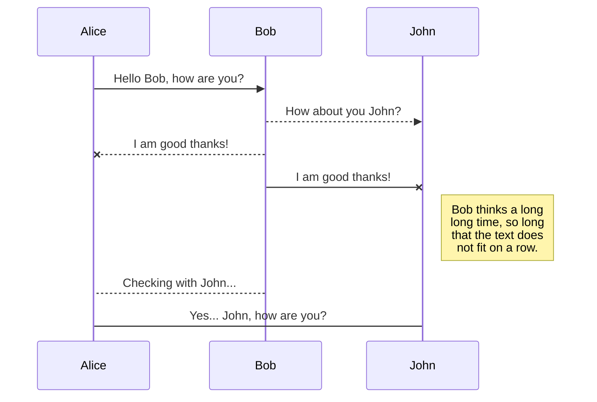
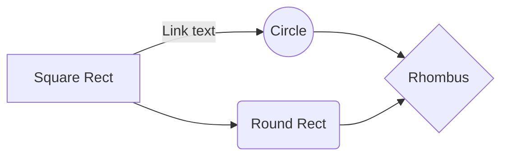

# Welcome to wxWidget Multi OS VSCode

Install VSCode and C/C++ Extensioin Pack.  

## Linux
### Preparation
install:
> sudo apt-get install build-essential gdb`
> sudo apt-get install wx

## Windows
### Preparation
build wxWidget, install and set directory in set wxWidget_dir in setting.json
> "wxWidget_dir": "C:\\Program Files (x86)\\wxWidgets",
> 

## Mac
### Preparation
Install brew, follow at https://brew.sh
Instal wxmac and check installation version
> brew install wxmac
> wx-configure --version

in progress
|                |ASCII                          |HTML                         |
|----------------|-------------------------------|-----------------------------|
|Single backticks|`'Isn't this fun?'`            |'Isn't this fun?'            |
|Quotes          |`"Isn't this fun?"`            |"Isn't this fun?"            |
|Dashes          |`-- is en-dash, --- is em-dash`|-- is en-dash, --- is em-dash|

## KaTeX Example

You can render LaTeX mathematical expressions using [KaTeX](https://khan.github.io/KaTeX/):

The *Gamma function* satisfying $\Gamma(n) = (n-1)!\quad\forall n\in\mathbb N$ is via the Euler integral

$$
\Gamma(z) = \int_0^\infty t^{z-1}e^{-t}dt\,.
$$

> You can find more information about **LaTeX** mathematical expressions [here](http://meta.math.stackexchange.com/questions/5020/mathjax-basic-tutorial-and-quick-reference).

## UML diagrams example

You can render UML diagrams using [Mermaid](https://mermaidjs.github.io/). For example, this will produce a sequence diagram:

And this will produce a flow chart:

